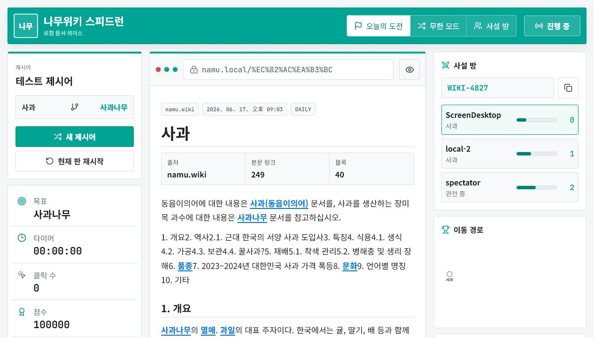
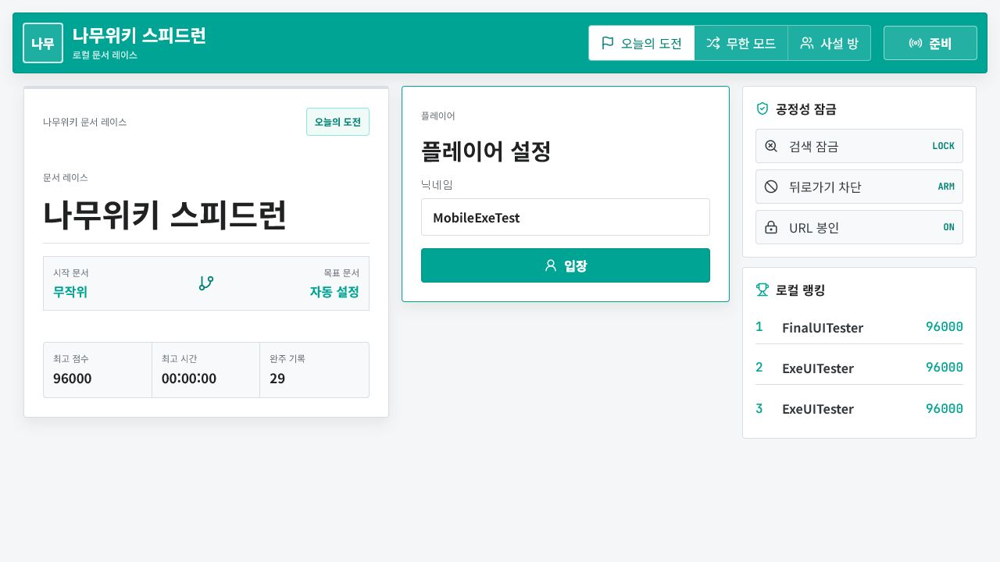
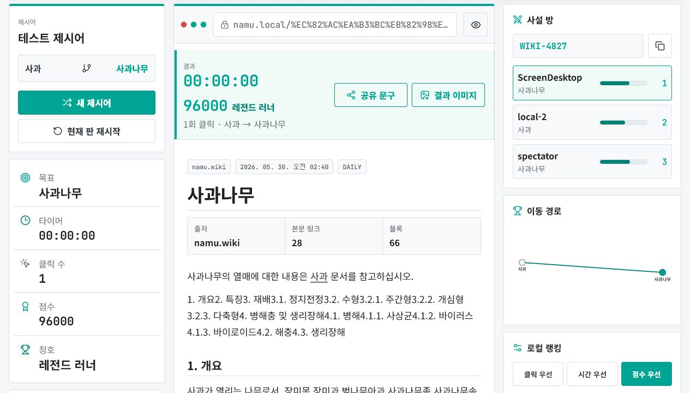
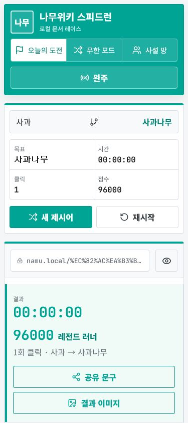

# WikiSpeedRun

나무위키 문서 링크만 눌러 출발 문서에서 목표 문서까지 최대한 빠르게 도달하는 로컬 전용 스피드런 앱입니다.

주소창 입력, 검색, 브라우저 뒤로 가기 같은 우회 동작을 막고, 서비스 내부에서 정제한 본문 링크만 클릭할 수 있게 만든 것이 핵심입니다.



## 주요 기능

- 나무위키 랜덤 문서를 기반으로 실제 본문 링크 경로가 검증된 출발어와 목적어 자동 생성
- 본문 내부 링크만 클릭 가능한 자체 브라우저 UI
- 캐주얼/연습 룰 모드
- 시간, 클릭 수, 점수 기록
- 클릭 우선, 시간 우선, 점수 우선 세션 랭킹
- 세션 랭킹 필터, JSON/CSV 저장, 세션 랭킹 초기화
- 이동 경로 그래프와 결과 공유 문구/이미지 생성
- 메인화면 복귀, 이전 문서 이동, 문서 내 찾기와 링크 이동
- `아예랜덤`으로 룰과 제시어를 한 번에 랜덤 설정
- 결과 이미지를 PNG로 바로 저장
- 데스크톱/모바일 반응형 UI
- Cloudflare Tunnel 외부 접속 링크 자동 표시와 복사
- Electron 기반 Windows EXE 패키징

## 화면

### 대기실



### 플레이 중


### 완주 결과



### 모바일



## 로컬 실행

```powershell
npm install
npm run dev
```

브라우저에서 `http://127.0.0.1:3001`을 엽니다.

개발 서버는 Vite 프론트엔드와 로컬 API 서버를 함께 실행합니다.

## 프로덕션 웹 실행

```powershell
npm run build
npm run server
```

브라우저에서 `http://127.0.0.1:3002`를 엽니다.

## Cloudflare Tunnel로 외부 공유

Cloudflare Tunnel을 쓰면 공유기 포트포워딩 없이 로컬에서 실행 중인 WikiSpeedRun을 외부 HTTPS 주소로 열 수 있습니다.

릴리즈 ZIP을 받은 경우에는 압축을 푼 뒤 `Start-WikiSpeedRun-Cloudflare.cmd`만 실행하면 됩니다. ZIP 안에는 portable EXE, `cloudflared.exe`, 시작 스크립트, 안내문이 함께 들어 있으므로 Node.js나 npm 설치가 필요 없습니다.

앱이 켜지면 우측의 `외부 접속` 패널에 현재 공유 주소가 표시됩니다. `외부 링크` 버튼으로 바로 복사할 수 있습니다.

### 임시 공유 URL

Cloudflare 계정이나 도메인 없이 빠르게 테스트할 때 사용합니다. 실행할 때마다 `trycloudflare.com` 임시 주소가 새로 만들어집니다.

```powershell
npm run cloudflare:quick
```

터미널과 앱의 `외부 접속` 패널에 아래 형태의 주소가 나오면 외부 사용자에게 공유합니다.

```text
https://example-random-name.trycloudflare.com
```

공유를 멈추려면 터미널에서 `Ctrl+C`를 누릅니다.

### 고정 도메인

방송이나 친구들과 반복해서 쓸 주소가 필요하면 Cloudflare 계정에 등록된 도메인으로 고정 터널을 만듭니다.

1. `npm run build`를 실행합니다.
2. `npm run server`로 앱을 `http://127.0.0.1:3002`에 띄웁니다.
3. Cloudflare 대시보드에서 `Zero Trust` 또는 `Networking > Tunnels`로 이동합니다.
4. Tunnel을 만들고 Public hostname을 추가합니다.
5. Service는 `HTTP`, URL은 `127.0.0.1:3002`로 지정합니다.
6. 안내되는 `cloudflared` 실행 명령을 로컬 PC에서 실행합니다.

로컬 관리형 터널을 쓸 경우 `cloudflare/config.example.yml`을 복사해서 hostname, tunnel ID, credentials 경로를 본인 환경에 맞게 바꿉니다.

외부 공개 시에는 아무나 접속할 수 있으므로, 공개 방송이 아니라면 Cloudflare Access로 이메일 로그인 같은 접근 제한을 거는 것을 권장합니다.

## Windows EXE 빌드

```powershell
npm install
npm run dist:win
```

빌드가 끝나면 아래 파일이 생성됩니다.

- `release/WikiSpeedRun-0.1.2-portable.exe`
- `release/WikiSpeedRun-0.1.3-portable.exe`
- `release/WikiSpeedRun-win32-x64/WikiSpeedRun.exe`
- `release/WikiSpeedRun-0.1.3-cloudflare.zip`

portable EXE 하나만 실행해도 내부 Node 서버와 Electron 창이 함께 실행됩니다. 외부 공유까지 포함한 배포는 `WikiSpeedRun-0.1.3-cloudflare.zip` 하나만 받으면 됩니다.

앱이 새로 시작될 때 이전 WikiSpeedRun 로컬 서버와 같은 포트의 Cloudflare 터널을 정리합니다. ZIP의 Cloudflare 시작 스크립트도 이전 터널을 먼저 닫고 새 터널 주소를 앱에 자동 반영합니다.

## 조작

- `이전 문서`: 현재 판의 이동 기록에서 한 단계 뒤로 이동합니다.
- `메인화면`: 진행 중인 판을 나가고 대기실로 돌아갑니다.
- `Ctrl+F` 또는 `Ctrl+F5`: 현재 문서 안에서 텍스트를 찾습니다.
- 찾기 결과가 본문 링크일 때 `링크 이동`으로 해당 문서로 바로 이동할 수 있습니다.
- `아예랜덤`: 캐주얼/연습 룰과 출발/목표 문서를 모두 랜덤으로 다시 설정합니다.
- `결과 저장`: 완주 결과 이미지를 PNG 파일로 바로 저장합니다.
- `외부 접속`: Cloudflare 터널 주소가 감지되면 외부 공유 링크를 복사합니다.

## API

- `GET /api/health`
- `GET /api/share-link`
- `POST /api/share-link`
- `DELETE /api/share-link`
- `GET /api/challenge?mode=casual`
- `GET /api/challenge?mode=practice`
- `GET /api/challenge?mode=wild`
- `GET /api/article?title=사과`
- `POST /api/run/event`
- `GET /api/rankings`
- `DELETE /api/rankings`
- `POST /api/players`
- `POST /api/runs`
- `GET /api/runs/:runId`
- `POST /api/runs/:runId/link`
- `POST /api/runs/:runId/back`
- `POST /api/runs/:runId/finish`

문서 파싱 결과는 `data/cache/articles`에 12시간 캐시됩니다.
자동 제시어는 서버가 시작 문서의 실제 본문 링크를 따라 랜덤 워크로 도달한 문서만 목표어로 지정합니다. 정답 경로는 클라이언트에 내려주지 않고, 검증된 클릭 수만 표시합니다.
랭킹은 서버가 켜진 순간부터 메모리에 적재되며, 서버를 재시작하면 초기화됩니다. Cloudflare Tunnel로 접속한 사용자도 같은 서버 세션 랭킹을 함께 봅니다.
완주 기록은 클라이언트가 직접 제출하지 않고, 서버가 `runId`별 이동 로그와 서버 기준 경과 시간으로 확정합니다.

## 점수

```text
score = max(0, 100000 - clicks * 4000 - elapsedSeconds * 35)
```

연습 모드는 점수를 화면에 보여주지만 세션 랭킹에는 저장하지 않습니다.

## 검증

최근 로컬 검증 결과입니다.

- `npm run build`: 통과
- Windows portable EXE 실행: 통과
- UI 완주 3회: `사과 -> 사과나무`, 1클릭 완주
- 랜덤 제시어 5회: 시작/목표 모두 실제 나무위키 문서이며 서버 검증 클릭 경로 존재 확인
- 모드 전환: 캐주얼, 연습 통과
- 아예랜덤: 룰과 제시어 랜덤 설정 통과
- 공유 문구, 결과 이미지, 랭킹 정렬, 세션 코드 버튼 통과
- 모바일 390x844: 가로 overflow 없음
- 브라우저 콘솔 오류: 0개
- `npm run stress`: 10/10 통과
- Cloudflare 외부 접속 링크 `/api/share-link`: 200 응답 확인

## 프로젝트 방향

이 프로젝트는 별도 서버에 공개 배포하기보다, 스트리머나 친구들이 로컬에서 공정하게 실행하는 프로그램형 사용성을 목표로 합니다.

나무위키를 iframe으로 직접 넣지 않고, 로컬 서버가 문서를 가져와 본문과 링크를 정제한 뒤 게임 UI에서만 렌더링합니다. 이렇게 하면 주소창 조작, 검색, 뒤로 가기 같은 우회 동작을 앱 레벨에서 제어할 수 있습니다.

외부 기기와 함께 사용하는 멀티플레이 확장 계획은 [외부 접속 및 멀티기기 대응 계획서](docs/external-multiplayer-plan.md)에 정리되어 있습니다.
